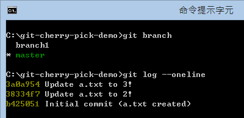

第 21 天：修正 commit 過的版本歷史紀錄 Part 3
=============================================================

在版本控管過程中，還有個常見的狀況，那就是當你在一個分支中開發了一段時間，但後來決定整個分支都不要了，不過當中卻有幾個版本還想留下，這時要刪除分支也不是，把這個分支合併回來也不是，那該怎麼辦呢？本篇文章將說明你該如何利用 `git cherry-pick` 指令「手動挑出」你想套用的變更。

準備本日練習用的版本庫
----------------------

在開始說明前，我們一樣先用以下指令建立一個練習用的工作目錄與本地儲存庫。文章看到這裡，想必各位看到指令應該都知道在做什麼事了吧。我們在一開始建立 2 個版本後，就建立了一個 `branch1` 分支，然後在分支裡建立了三個版本，其中一個版本為新增一個 `b.txt` 檔案。最後我們再切換回 `master` 分支，並新增一個變更：

	mkdir git-cherry-pick-demo
	cd git-cherry-pick-demo
	git init

	echo 1 > a.txt
	git add .
	git commit -m "Initial commit (a.txt created)"

	echo 2 > a.txt
	git add .
	git commit -m "Update a.txt to 2!"

	git checkout -b branch1

	echo 3 > a.txt
	git add .
	git commit -m "Update a.txt to 3!"

	echo b > b.txt
	git add .
	git commit -m "Add b.txt!"

	echo 4 > a.txt
	git add .
	git commit -m "Update a.txt to 4!"

	git checkout master

	echo 3 > a.txt
	git add .
	git commit -m "Update a.txt to 3!"

如果我們用 SourceTree 查看儲存庫的 commit graph (版本線圖) 的話，可以看到如下圖藍色的部分是我們 `master` 分支的變化，一共三個版本。紅色是 `branch1` 的分支，如果僅以這個分支來看也有三個版本。

使用 `git cherry-pick` 命令的注意事項
---------------------------------------

首先，你的「工作目錄」必須是乾淨，工作目錄下的「索引」不能有任何準備要 commit 的檔案 (staged files) 在裡面，否則將會無法執行。

使用 `git cherry-pick` 命令
-----------------------------

使用 `git cherry-pick` 跟使用 `git revert` 非常相似，也是讓你「挑選」任意一個或多個版本，然後套用在目前分支的最新版上，但主要差異則在於「`git revert` 執行的是相反的合併，而 `git cherry-pick` 則是重新套用完全相同的變更」，但一樣都是透過「合併」的方式進行，所以本篇文章我不會做太多類似的相關練習，而是專注在講解兩種指令上的差異。

**註**：`cherry-pick` 的英文是「撿櫻桃」的意思，代表你可以從其他籃子(分支)「挑」一些好的櫻桃到自己的籃子(分支)裡！

各位在使用 `git cherry-pick` 命令時，最好搭配 SourceTree 等 GUI 工具，查看你想要「挑選」出來的版本，然後套用在目前的分支上 (當然是套用在目前的 `HEAD` 版本之後)。

目前我們位於 `master` 分支上，若要查詢 `branch1` 的所有紀錄，我們執行 `git log branch1` 即可 (如下圖加上 `-4` 代表僅顯示前 4 筆紀錄)：

今天我想套用 `branch1` 的 `dc07017  Add b.txt!` 這個版本到目前的 `master` 版本上，可以執行 `git cherry-pick dc07017` 命令，若成功執行，則會在目前的 `master` 分支建立一個新版本。

不過，與 `git revert` 最大的不同之處，就在於執行完 `git cherry-pick` 命令後，其建立的版本訊息，將會與你指定挑選的那些版本一模一樣，其中包括 **Author** 與 **Date** 欄位，都會一模一樣，並不會用你在選項設定中指定的 `user.name` 與 `user.email` 參數。這點你必須特別注意！

使用 `git cherry-pick` 命令的其他參數
---------------------------------------

你可以選擇加上 `-x` 參數在指令列上，就會像 `git revert` 那樣，自動加上 `(cherry picked from commit dc070173c8d087b4e65084653e31b81910f3f2e5)` 的訊息，如下圖示：

不過，做這個動作之前也請先思考，你這次挑選的版本是不是只有「本地才有的分支」上挑選的，如果是的話，這樣的紀錄可能會造成其他人的混淆，因為他們查不到該版本的任何資訊。這在使用遠端儲存庫的情境比較會碰到。

如果希望在建立版本前先編輯訊息，那麼你可以輸入 `git cherry-pick dc07017 -e` 指令。

如果你不想建立版本，僅套用其變更，那麼你可以執行 `git cherry-pick dc07017 -n` 指令，這樣就不會自動建立版本，你可以在加上自己的修改後，執行 `git commit` 建立版本。透過 `-n` 參數，這次建立的版本就會留下自己的 Author & Date 資訊！

今日小結
-------

今天大家學到如何「撿櫻桃」的技巧，不過我沒辦法教你「怎樣挑出好的櫻桃」，這就要問你自己才知道了！ :-)

我重新整理一下本日學到的 Git 指令與參數：

* git cherry-pick [commit_id]
* git cherry-pick [commit_id] -e
* git cherry-pick [commit_id] -x
* git cherry-pick [commit_id] -n

-------
* [回目錄](README.md)
* [前一天：修正 commit 過的版本歷史紀錄 Part 2 (revert)](20.md)
* [下一天：修正 commit 過的版本歷史紀錄 Part 4 (rebase)](22.md)

-------

